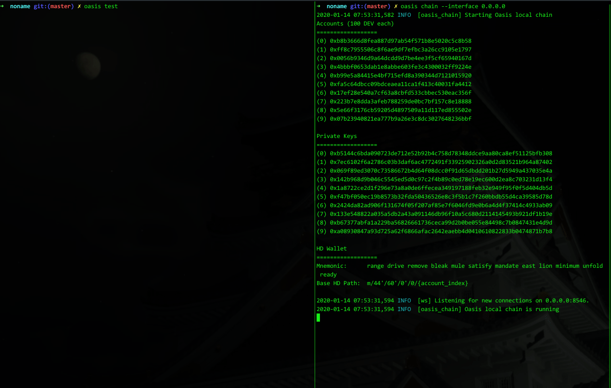

## Evaluations

### CPU-time

The CPU-time is evaluated from two aspects: the client side and the server side. For more details, we refer the reader to [client-side jupyternote](./client-side_CPU_time.ipynb), [client-side logs](./client-side_CPU_time.csv), [server-side logs](./server-side_CPU_time.log)

### Lantency & Gas cost

We use `oasis test` to test the lantency and gas cost, the detailed results are recorded in [oasis_logs](./oasis_logs.log).

